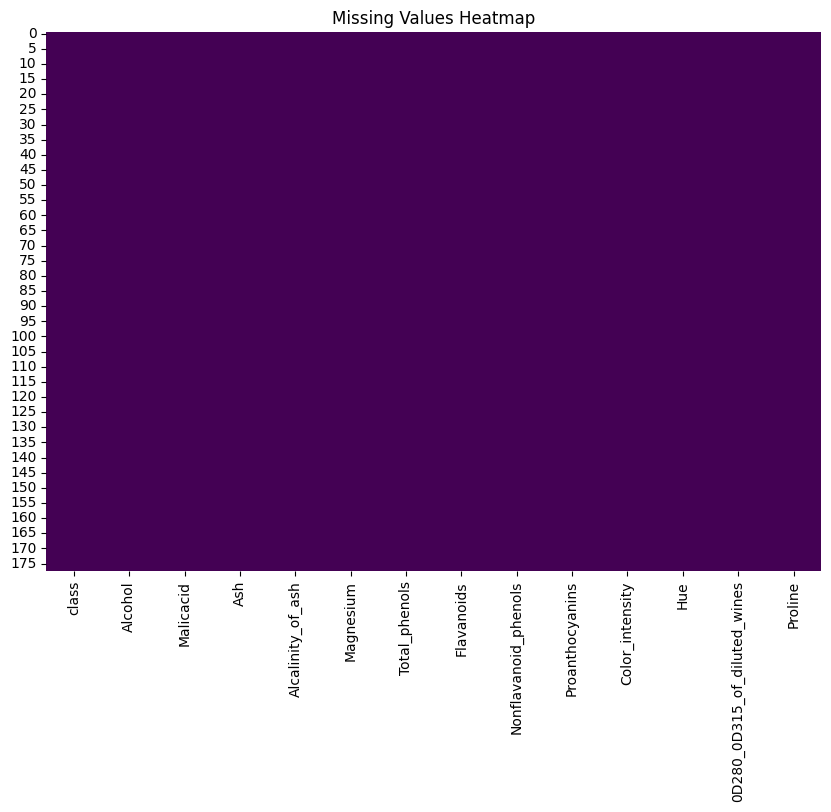
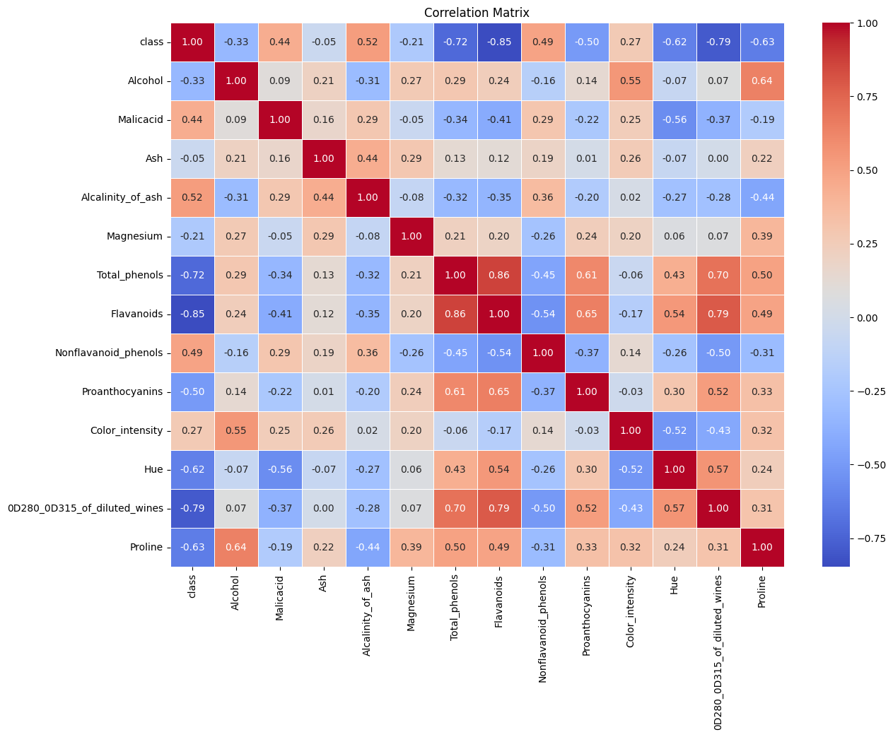
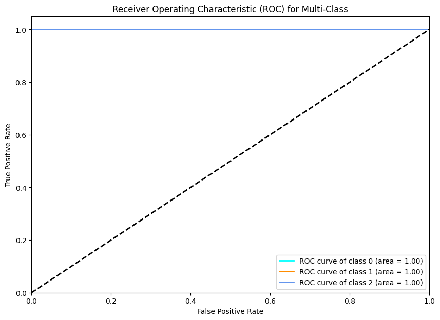

# Wine Classification Project

## Description
This project involves the classification of wine samples based on their chemical properties. The dataset used for this project is the Wine dataset, which contains 178 samples of wine with 13 features each. The goal is to classify the samples into three classes: Class 0, Class 1, and Class 2.

## Dataset
The dataset used in this project is the Wine dataset, which is available in the `wine.csv` file.

## Setup and Installation
To run this project, you need to have Python and the following libraries installed:
- `pandas`
- `numpy`
- `scikit-learn`
- `matplotlib`
- `seaborn`

You can install the required libraries using the following command:
```bash
pip install pandas numpy scikit-learn matplotlib seaborn
```

## Running the Code
1. Load the dataset: Load the dataset from the CSV file and display the first few rows to understand the structure of the data.
```python
import pandas as pd

wines = pd.read_csv('wine.csv')
pd.set_option('display.max_columns', None)  # Show all columns
pd.set_option('display.float_format', '{:.2f}'.format)  # Format floats to 2 decimal places
print(wines.head().to_string(index=False))
```
2. Check for missing values: Visualize any missing values in the dataset using a heatmap.

```python
import matplotlib.pyplot as plt
import seaborn as sns

plt.figure(figsize=(10, 7))
sns.heatmap(wines.isnull(), cbar=False, cmap='viridis')
plt.title('Missing Values Heatmap')
plt.show()
```

3. Correlation matrix: Visualize the correlation between different features in the dataset.

```python
plt.figure(figsize=(14, 10))
sns.heatmap(wines.corr(), annot=True, fmt='.2f', cmap='coolwarm', linewidths=0.5)
plt.title('Correlation Matrix')
plt.show()
```

4. Preprocess the data: Encode the class labels and split the data into training and testing sets.

```python
from sklearn.model_selection import train_test_split
from sklearn.preprocessing import StandardScaler, LabelEncoder, label_binarize

label_column = 'class'
label_encoder = LabelEncoder()
wines[label_column] = label_encoder.fit_transform(wines[label_column])

X = wines.drop(label_column, axis=1)
y = wines[label_column]

X_train, X_test, y_train, y_test = train_test_split(X, y, test_size=0.2, random_state=42)

scaler = StandardScaler()
X_train = scaler.fit_transform(X_train)
X_test = scaler.transform(X_test)
```

5.Hyperparameter tuning using OneVsRestClassifier: Perform hyperparameter tuning to find the best parameters for the model.

```python
from sklearn.model_selection import GridSearchCV
from sklearn.linear_model import LogisticRegression
from sklearn.multiclass import OneVsRestClassifier

param_grid = {'estimator__C': [0.01, 0.1, 1, 10, 100]}
grid_search = GridSearchCV(OneVsRestClassifier(LogisticRegression(solver='liblinear', max_iter=5000)), param_grid, cv=5)
grid_search.fit(X_train, y_train)
best_params = grid_search.best_params_
print('Best parameters:', best_params)
```

6. Train the model with the best hyperparameters: Train the model using the best hyperparameters found in the previous step.

```python
best_model = grid_search.best_estimator_
best_model.fit(X_train, y_train)
```

7. Evaluate the model: Evaluate the model using a confusion matrix and classification report.

```python
from sklearn.metrics import confusion_matrix, classification_report

y_pred = best_model.predict(X_test)
conf_matrix = confusion_matrix(y_test, y_pred)
class_report = classification_report(y_test, y_pred, output_dict=True)
class_report_df = pd.DataFrame(class_report).transpose()
```

8. Visualization of the Confusion Matrix: Visualize the confusion matrix using a heatmap.

```python
plt.figure(figsize=(10, 7))
sns.heatmap(conf_matrix, annot=True, fmt='d', cmap='Blues', xticklabels=label_encoder.classes_, yticklabels=label_encoder.classes_)
plt.xlabel('Predicted Label')
plt.ylabel('True Label')
plt.title('Confusion Matrix')
plt.show()
```

9. Visualization of the Classification Report: Visualize the classification report using a heatmap.

```python
plt.figure(figsize=(10, 4))
sns.heatmap(class_report_df.iloc[:-1, :].T, annot=True, cmap='Blues', fmt=".2f")
plt.title('Classification Report')
plt.show()
```

10. ROC curve and AUC for each class: Plot the ROC curve and AUC for each class.

```python
from sklearn.metrics import roc_curve, auc

y_test_bin = label_binarize(y_test, classes=[0, 1, 2])
y_pred_prob = best_model.predict_proba(X_test)

fpr = dict()
tpr = dict()
roc_auc = dict()
for i in range(3):
    fpr[i], tpr[i], _ = roc_curve(y_test_bin[:, i], y_pred_prob[:, i])
    roc_auc[i] = auc(fpr[i], tpr[i])

plt.figure(figsize=(10, 7))
colors = cycle(['aqua', 'darkorange', 'cornflowerblue'])
for i, color in zip(range(3), colors):
    plt.plot(fpr[i], tpr[i], color=color, lw=2,
             label='ROC curve of class {0} (area = {1:0.2f})'
             ''.format(i, roc_auc[i]))

plt.plot([0, 1], [0, 1], 'k--', lw=2)
plt.xlim([0.0, 1.0])
plt.ylim([0.0, 1.05])
plt.xlabel('False Positive Rate')
plt.ylabel('True Positive Rate')
plt.title('Receiver Operating Characteristic (ROC) for Multi-Class')
plt.legend(loc="lower right")
plt.show()
```

## Results Overview

### Missing Values Heatmap
This heatmap shows that there are no missing values in the dataset.



### Correlation Matrix
This correlation matrix visualizes the relationships between different features in the dataset. It helps identify which features are highly correlated with the target class and with each other.



### Confusion Matrix
The confusion matrix shows the performance of the classification model, displaying the true labels against the predicted labels.


### Classification Report
The classification report provides a detailed performance analysis of the model, including precision, recall, and F1-score for each class.


### ROC Curve for Multi-Class
The ROC curve demonstrates the model's ability to distinguish between different classes. The AUC (Area Under the Curve) values for each class are shown in the legend.


